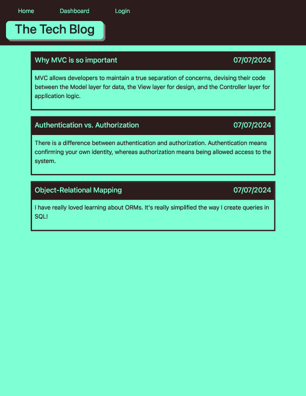
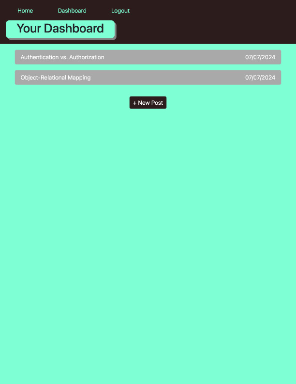
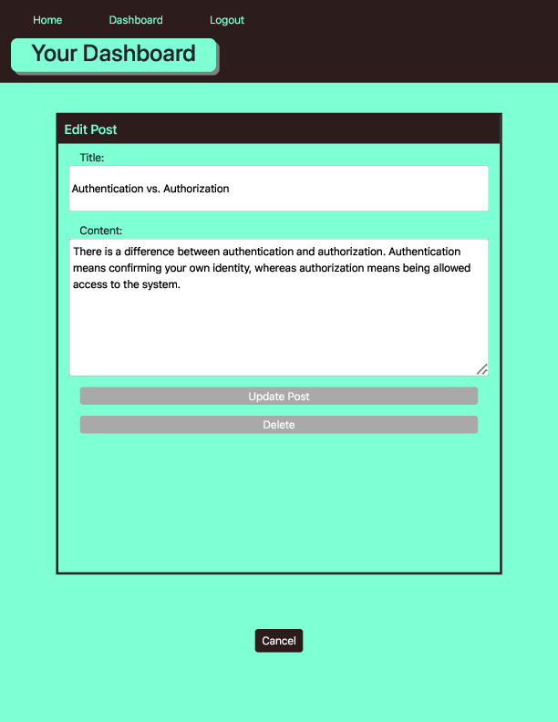

# Tech Blog

## Description
This is a CMS-style blog site where developers can create blog posts and interact with other developers' posts by commenting or liking them. This app follows the MVC paradigm in its construction. 

## Table of Contents
- [Installation](#installation)
- [Usage](#usage)
- [License](#license)
- [Contributing](#contributing)
- [Tests](#tests)
- [Questions](#questions)

## Installation
This app utilizes npm for package management. Dependencies include bcrypt, body-parser, connect-session-sequelize, dotenv, express, express-handlebars, express-session, moment, mysql2, and sequelize. Users can install all dependencies by running 'npm i' in the terminal.

## Usage
A live version of this app can be found at https://berkeley-bootcamp-tech-blog-000f1a91a27f.herokuapp.com/. To begin creating and interacting with blog posts, start by creating your own profile.

To use this app locally, users should first have a MySQL server running. This can be done by running 'brew service start mysql' in the terminal if MySQL was downloaded using Homebrew. After that, users should seed the database. This can be done by running 'node seeds/index.js' in the terminal. Then, running 'node server.js' in the terminal will start the app locally on port 3000.

## Liscense
None.

## Contributing
There are no contribution guidelines.

## Tests
There are no test instructions.

## Questions
If you have any questions, you can contact me at [odiazstrandberg@gmail.com](mailto:odiazstrandberg@gmail.com). 
You can also find more of my work at [ojds2022](https://github.com/ojds2022).

